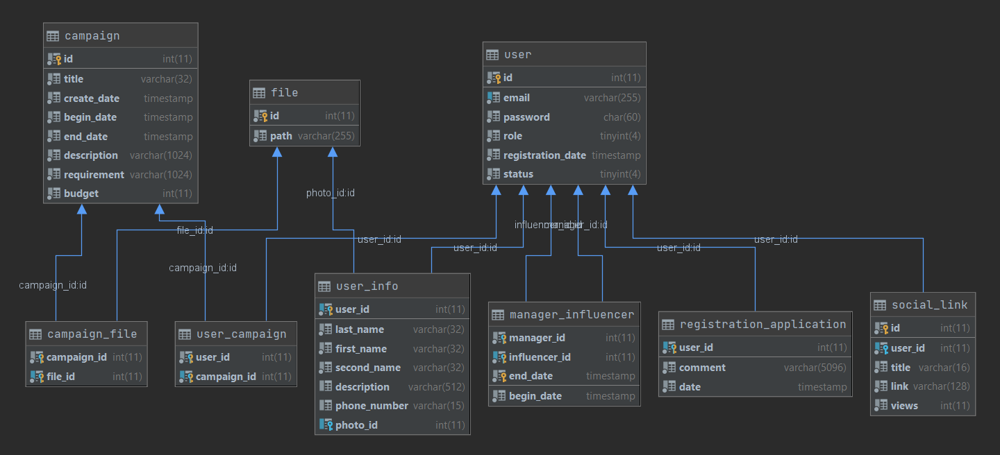

# final-task-JWD

A platform for interaction between advertisers and influencers.

Available roles(login/password):
- Administrator(admin@mail.ru/admin)
- Advertiser(advertiser@mail.ru/advertiser)
- Influencer(influencer@mail.ru/influencer)
- Manager(manager@mail.ru/manager)

Advertisers add and edit ad campaigns, influencers can
choose which advertising campaigns they want to participate in.
Managers can have a list curated influencers he signs up to participate 
in advertising campaigns. The administrator can view and delete advertisers, 
advertising campaigns, media, influencers. The administrator accepts 
applications for registration of advertisers, managers, influencers.

List of used technologies:
- JavaEE
- JSP
- JSTL
- JDBC
- MariaDB
- Log4j
- TestNG
- Maven
- Apache Tomcat

Database diagram: 